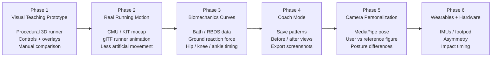
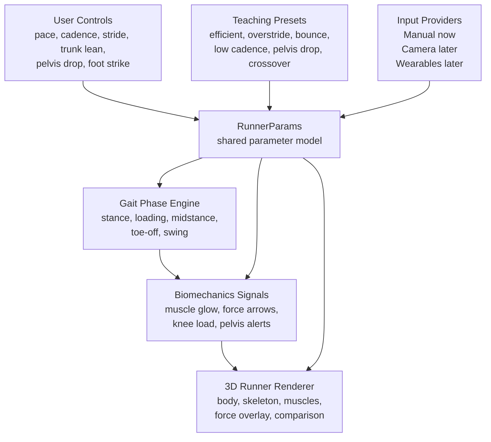
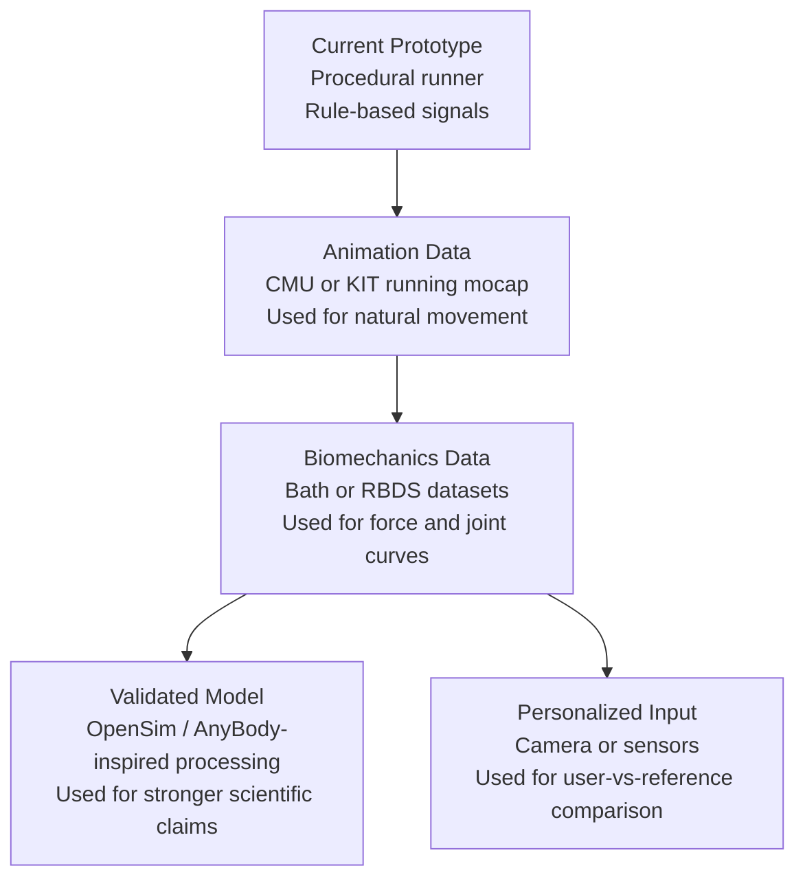
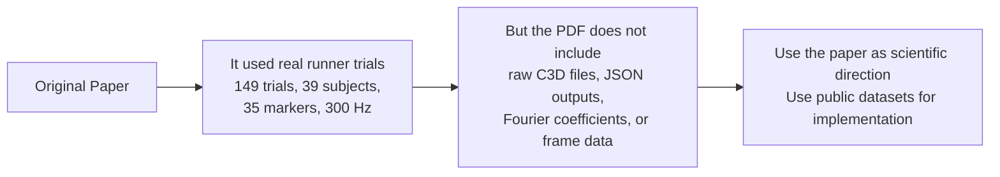
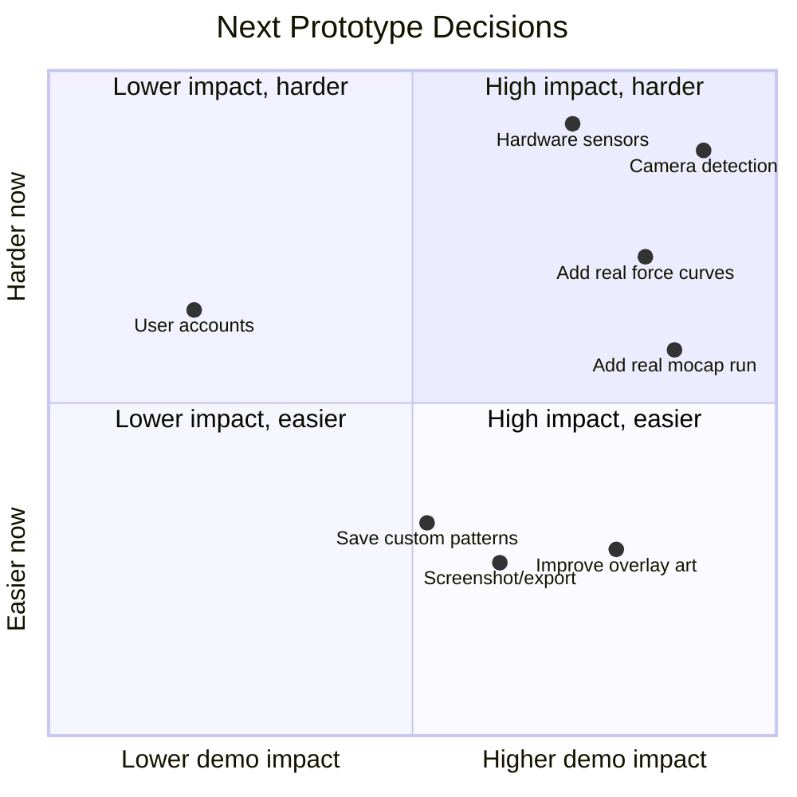

# Propriocept Run Prototype Visual Roadmap

This is a partner-facing visual summary of the current prototype path.

## One-Line Strategy

Build the product in this order:

```text
Compelling visual teaching tool
→ real runner motion
→ real biomechanics curves
→ manual coach comparison
→ camera personalization
→ optional sensors/hardware
```

## Product Roadmap



## System Architecture



## Data Upgrade Path



## What The Original Paper Means For Us



## Near-Term Build Priorities



## Partner Summary

The current prototype proves the visual teaching concept. The next step should not be camera or hardware yet. The strongest next upgrade is to make the runner and overlays data-driven:

1. Add a real running mocap animation from CMU or KIT.
2. Add real gait-cycle curves from Bath or RBDS.
3. Use those curves to drive force arrows and muscle timing.
4. Polish comparison mode for funder and coach demos.
5. Add camera personalization only after the reference visualization is compelling.

This keeps the project fundable: it looks real, is technically believable, and avoids overpromising clinical accuracy too early.
