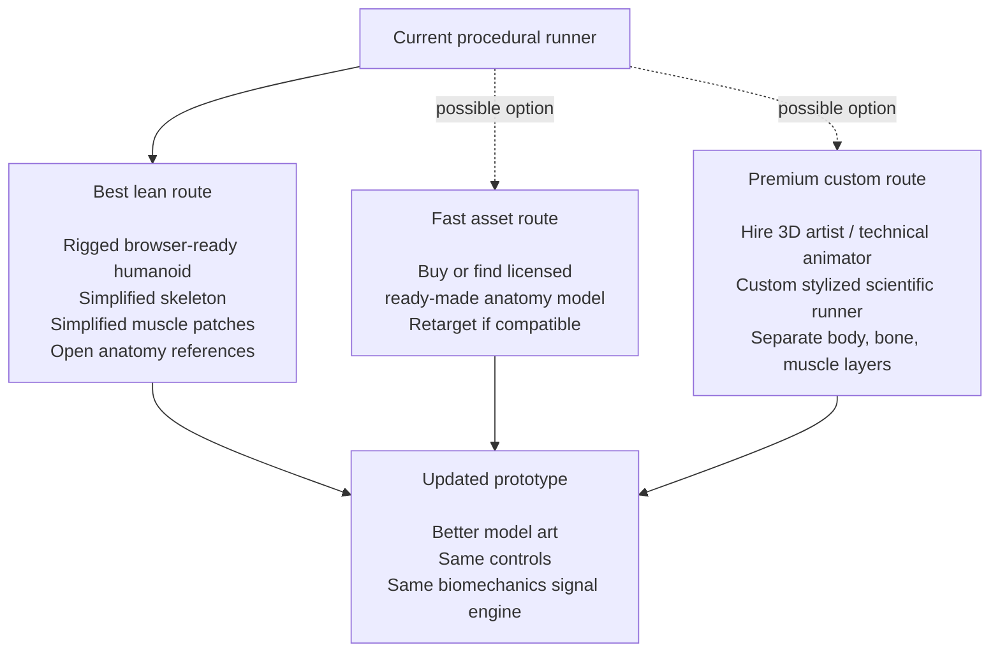
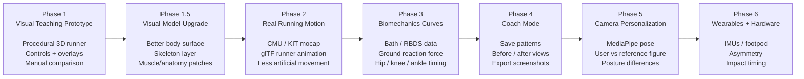
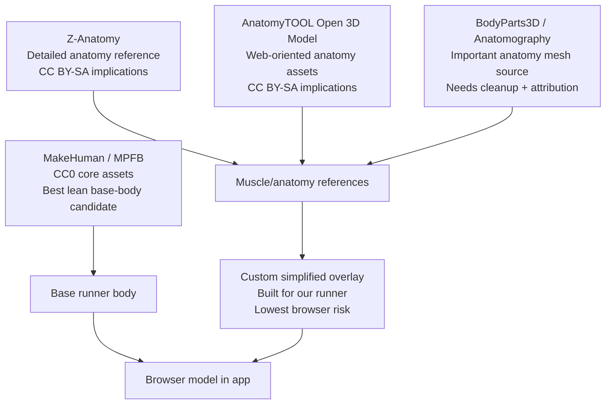
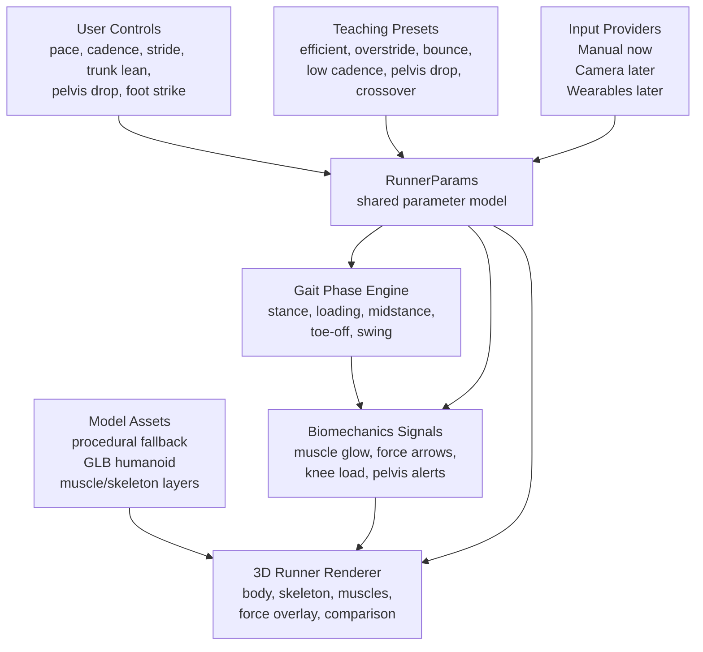
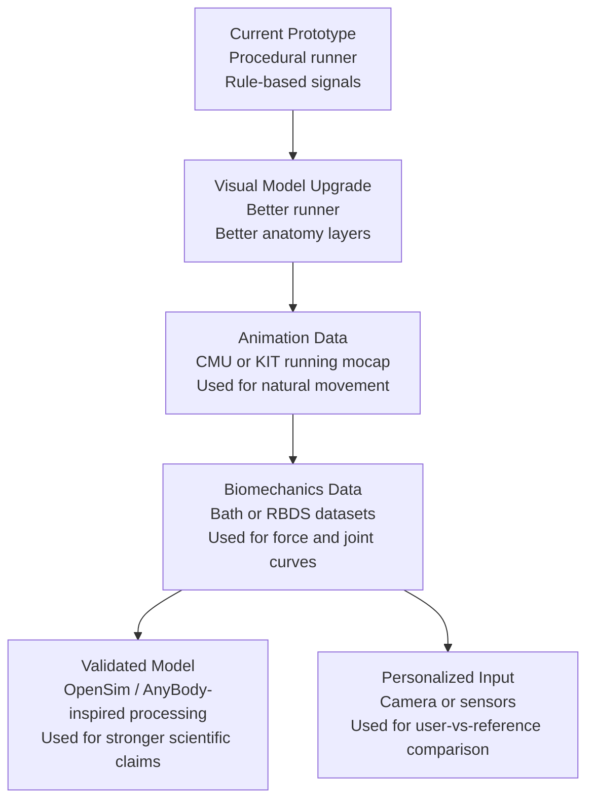
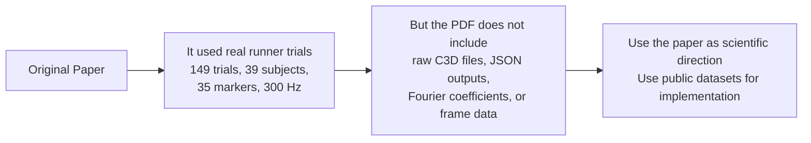
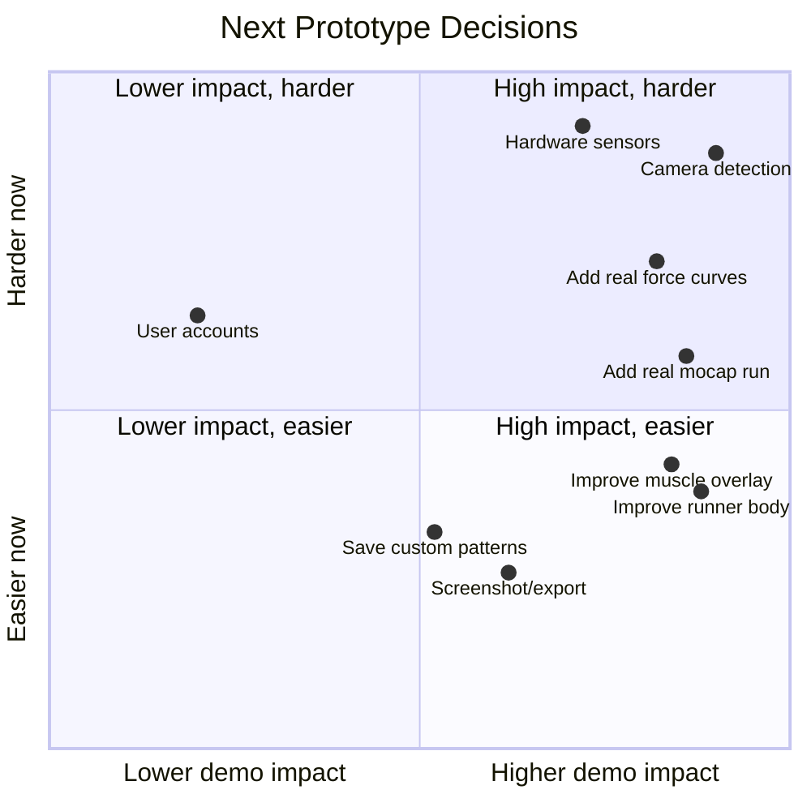

# Propriocept Run Prototype Visual Roadmap

This is a partner-facing visual summary of the current prototype path.

## One-Line Strategy

Build the product in this order:

```text
Credible visual runner model
-> compelling teaching overlays
-> real runner motion
-> real biomechanics curves
-> manual coach comparison
-> camera personalization
-> optional sensors/hardware
```

## Current Visual Model Decision

The weakest part of the current prototype is no longer the app architecture. It is the visual quality of the runner, skeleton, and muscle layers. The best lean route is to upgrade the model art first, while keeping the two bigger routes available if funding or asset discovery changes the plan.



## Product Roadmap



## Visual Asset Source Map



## System Architecture



## Data Upgrade Path



## What The Original Paper Means For Us



## Near-Term Build Priorities



## Partner Summary

The current prototype proves the visual teaching concept, but the visual model is now the bottleneck. The strongest next upgrade is to make the runner and anatomy layers more credible before spending more time on camera detection or expensive sensors.

1. Upgrade the runner model and simplified anatomy layers.
2. Keep the best lean route as the default.
3. Keep the fast licensed-asset route and premium custom-art route as options.
4. Add real running mocap from CMU or KIT after the model can carry the visual concept.
5. Add real gait-cycle curves from Bath or RBDS.
6. Add camera personalization only after the reference visualization is compelling.

Blender is not required to run the app. It is useful later for asset cleanup, retargeting, polygon reduction, material fixes, and GLB export.
